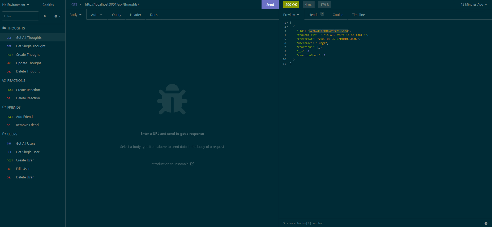

# Social Network API

## Description

This is a back-end application the runs off of MongoDB and Express.js. All CRUD operations are run through Mongoose, an ODM library for MongoDB that allows for NoSQL databases to be handled and managed in a similar format to SQL databases.

## Usage

`npm i`

`npm start`

This API requires Insomnia to perform the CRUD operations.

## Routes

`Users` and `Thoughts` both have all basic CRUD operations that can be accessed through Insomnia's back-end API development methods. There is no data within the API at the moment, but there are no errors present when inserting new JSON objects.

The `Friends` subdocument will only populate on the original userId the submission is made to, an easily fixable error that stems from the route in the `userController`.

## Documentation

[Routes Documentation](https://www.youtube.com/watch?v=TZUwrJwvObU)

